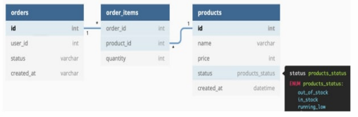

# Система администрирования заказов
Необходимо написать приложение, которое будет позволять администрировать
заказы интернет-магазина. Взаимодействие пользователя с приложением происходит через REST API.
###Бизнес требования
Структура базы данных:

###Необходимый функционал в приложении
######По продукту:
1. Создание продукта. При создании продукта статус генерировать
случайным образом из доступных значений (enum ProductStatus).
2. Редактирование продукта.
3. Удаление продукта. Нельзя удалить продукт в статусах IN_STOCK и
RUNNING_LOW.
4. Список всех продуктов, с сортировкой от большего количества заказов к
меньшему. Вернуть список значений со следующими полями (название
продукта, цена, количество заказов по продукту). Желательно
имплементировать с помощью SQL-запроса.
######По заказу:
1. Создание заказа. Нельзя создавать заказ без списка продуктов, с
продуктами в статусе OUT_OF_STOCK и без userId. При успешном
создании заказа возвращаем его id.
2. Получить список всех заказов за период времени, отсортированный по
userId и дате создания заказа.
###Требования к коду
* приложение должно быть реализовано на языке Java версии 11;
* код должен соответствовать 4 принципам ООП;
* код должен соответствовать Java Code Style (именование переменных,
структура класса и др.);
* приложение должно содержать качественную обработку ошибок;
* для работы со списками данных необходимо использовать коллекции;
* можно использовать Spring Framework.
